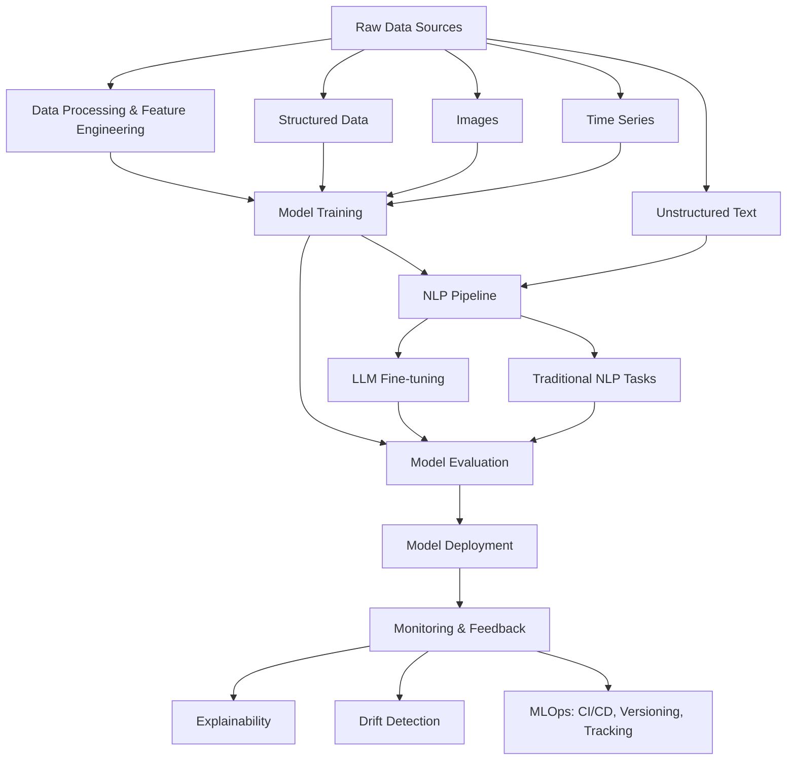

# Machine Learning, NLP, and LLM Ecosystem: High-Level Overview

This document provides a conceptual overview of the modern AI/ML ecosystem, focusing on the journey from data to deployment, with a special emphasis on NLP and LLMs. It now also includes vision and time series use cases.

---

## Ecosystem Diagram

---

## Key Components (with Examples)

- **Raw Data Sources**: Where your data comes from. Can be structured (tabular data, e.g., spreadsheets), unstructured (text, images, audio), or time series (sensor logs, stock prices).
  - *Example:* Downloading the MNIST image dataset, or collecting tweets for sentiment analysis.
- **Data Processing & Feature Engineering**: Cleaning, transforming, and preparing data for modeling. Includes tokenization for text, normalization for images, and lag features for time series.
  - *Example:* Removing stopwords from text, scaling pixel values in images, or creating rolling averages for time series.
- **Model Training**: Building models using classical ML (scikit-learn, XGBoost), deep learning (TensorFlow, PyTorch), or specialized libraries for NLP (spaCy, Transformers), vision (torchvision), or time series (Prophet).
  - *Example:* Training a RandomForest for tabular data, a CNN for MNIST images, or Prophet for forecasting airline passengers.
- **NLP Pipeline**: Specialized steps for text, such as tokenization, embeddings, and sequence modeling.
  - *Example:* Using BERT embeddings for text classification.
- **LLM Fine-tuning**: Adapting large pre-trained models (e.g., BERT, GPT) to specific tasks/domains.
  - *Example:* Fine-tuning DistilBERT for movie review sentiment analysis.
- **Model Evaluation**: Assessing model performance using metrics (see [NLP Evaluation Metrics Guide](nlp_evaluation_metrics.md)), validation, explainability, and fairness.
  - *Example:* Calculating accuracy for classification, ROUGE for summarization, or ARI for clustering.
- **Model Deployment**: Making models available for use, e.g., via REST APIs (FastAPI), batch jobs, streaming, or containerization (Docker, Kubernetes).
  - *Example:* Deploying a FastAPI service for real-time image classification.
- **Monitoring & Feedback**: Tracking model performance, detecting drift, collecting user feedback, and retraining as needed.
  - *Example:* Logging prediction errors, monitoring accuracy over time, or retraining a model when performance drops.
- **Explainability**: Understanding and interpreting model decisions (SHAP, LIME, feature importance, attention visualization).
  - *Example:* Using SHAP to explain why a model predicted "spam" for an email.
- **Drift Detection**: Identifying changes in data/model performance over time.
  - *Example:* Detecting that new images are from a different distribution than training data.
- **MLOps**: Practices and tools for CI/CD, data/model versioning (DVC), experiment tracking (MLflow), automation, and governance.
  - *Example:* Using GitHub Actions for automated testing, DVC for data versioning, and MLflow for experiment tracking.

---

## How the Stages Connect
- The process is often cyclical: after deployment, monitoring may reveal issues (e.g., drift, new data types), prompting new data collection, retraining, or feature engineering.
- Feedback from users or monitoring can lead to continuous improvement.
- All use cases in this project (tabular ML, NLP, LLMs, vision, time series, deployment, monitoring, MLOps) fit into this ecosystem.

---

For practical code examples and more details, see the [architecture_with_code.md](architecture_with_code.md) and the individual use case READMEs. For evaluation metrics, see [nlp_evaluation_metrics.md](nlp_evaluation_metrics.md).

This overview sets the stage for the practical use cases and deeper technical documentation in this project. 