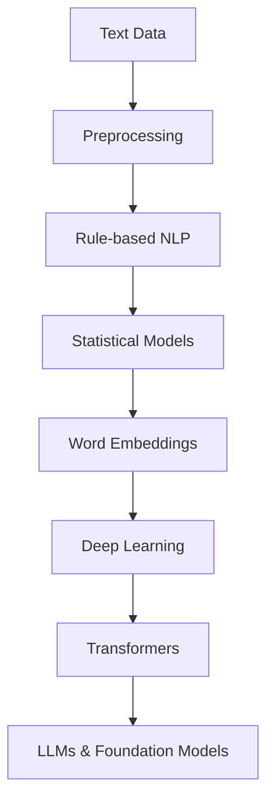
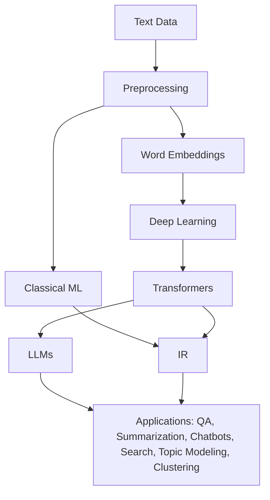

# NLP Evolution: Techniques, Models, and Ecosystem Guide

---

## 1. Chronological Evolution of NLP

Natural Language Processing (NLP) is the field of computer science and artificial intelligence focused on enabling computers to understand, interpret, and generate human language. NLP has evolved through several major phases, each building on the previous advances.

### Timeline & Key Milestones
- **1950s–1980s: Rule-based, Symbolic NLP**
  - Early systems used hand-crafted rules and dictionaries (e.g., ELIZA chatbot, 1966).
  - Focus: pattern matching, grammar rules, parsing.
  - **Limitation:** Not robust to language variability, hard to scale.
- **1990s: Statistical NLP**
  - Introduction of probabilistic models (n-grams, Hidden Markov Models, Conditional Random Fields).
  - Focus: part-of-speech tagging, named entity recognition, speech recognition, topic modeling (e.g., LDA).
  - **Limitation:** Required lots of labeled data, struggled with long-range dependencies.
- **2000s: Machine Learning for NLP**
  - Use of SVMs, logistic regression, decision trees with bag-of-words or TF-IDF features.
  - Focus: text classification, spam detection, sentiment analysis, clustering (e.g., K-means for document grouping).
  - **Limitation:** Ignored word order/context, limited semantic understanding.
- **2013–2017: Word Embeddings**
  - Word2Vec, GloVe, FastText: words represented as dense vectors capturing semantic similarity.
  - **Advantage:** Improved downstream ML/DL models, enabled semantic search, better clustering and topic modeling.
  - **Limitation:** Each word has a single vector (context-free).
- **2014–2018: Deep Learning**
  - RNNs, LSTMs, GRUs, CNNs for text: sequence modeling, better context handling.
  - Focus: machine translation, sentiment analysis, question answering, text classification, sequence labeling.
  - **Limitation:** Training is slow, struggles with very long sequences.
- **2018–present: Transformers & LLMs**
  - BERT, GPT, T5, RoBERTa, XLNet, etc.: self-attention, parallelization, transfer learning.
  - LLMs (GPT-3/4, PaLM, Llama): few-shot learning, text generation, chatbots, code, advanced topic modeling, clustering, and more.
  - **Advantage:** State-of-the-art on almost all NLP tasks, can generalize to new tasks.
  - **Limitation:** Require large compute/resources, can be opaque/biased.

---

## 2. Text Data Processing Techniques: Tradeoffs & Comparisons

Before feeding text to a model, it must be preprocessed. Each technique has tradeoffs:

| Technique                | Description                        | Pros                        | Cons                        | Example |
|--------------------------|------------------------------------|-----------------------------|-----------------------------|---------|
| Tokenization             | Split text into words/subwords     | Simple, fast                | Loses context, ambiguity    | "I love NLP!" → ["I", "love", "NLP", "!"] |
| Lemmatization/Stemming   | Reduce words to root form          | Reduces sparsity            | May lose nuance             | "running" → "run" |
| Stopword Removal         | Remove common words                | Reduces noise               | May remove useful info      | "the", "is", "and" removed |
| Bag-of-Words/TF-IDF      | Vectorize text (frequency-based)   | Simple, interpretable       | Ignores order/context       | "cat sat mat" → [1,1,1] |
| Word Embeddings          | Dense vector representations       | Captures similarity         | Static, context-free        | "king" - "man" + "woman" ≈ "queen" |
| Contextual Embeddings    | Vectors depend on context (BERT)   | Rich, context-aware         | Requires large models       | "bank" in "river bank" vs. "money bank" |
| Subword/Byte-Pair Encoding| Handles rare/unknown words        | Robust to OOV               | More complex, less interpretable | "unhappiness" → ["un", "happiness"] |

**Key Point:**
- Early techniques (tokenization, stemming) are fast and simple, but lose nuance.
- Modern techniques (embeddings, contextual models) capture meaning and context, but require more resources.

---

## 3. NLP Modeling Types: Overview & Usage

NLP covers a wide range of modeling types, each with specific use cases and typical algorithms:

| Modeling Type         | Description/Goal                        | Common Algorithms/Models         | Example Use Cases                |
|----------------------|-----------------------------------------|----------------------------------|----------------------------------|
| **Text Classification** | Assign a label to text (single/multi-label) | Logistic Regression, SVM, CNN, BERT | Spam detection, sentiment analysis, topic labeling |
| **Topic Modeling**      | Discover abstract topics in a corpus   | LDA, NMF, BERTopic, LLMs         | News clustering, content discovery |
| **Clustering**         | Group similar texts/documents          | K-means, Agglomerative, embeddings | Customer segmentation, deduplication |
| **Sequence Labeling**  | Assign a label to each token           | HMM, CRF, LSTM, BERT             | POS tagging, NER, chunking        |
| **Text Generation**    | Generate new text                      | RNN, LSTM, GPT, T5, LLMs         | Chatbots, summarization, translation |
| **Information Extraction** | Extract structured info from text    | Rule-based, CRF, BERT, spaCy     | Entity/relation extraction, event detection |
| **Retrieval/Ranking**  | Find and rank relevant documents       | BM25, BERT, ColBERT, dense retrievers | Search engines, QA systems        |
| **Summarization**      | Generate a concise summary             | Seq2Seq, T5, BART, Pegasus, LLMs | News summarization, legal docs    |
| **Translation**        | Translate text between languages       | RNN, Transformer, MarianMT, LLMs | Google Translate, localization    |
| **Question Answering** | Answer questions from text             | BERT, T5, GPT, LLMs              | Virtual assistants, search        |

**Note:** Many modern models (especially transformers and LLMs) can be adapted for multiple tasks (e.g., BERT for classification, NER, QA).

---

## 4. NLP Models: Evolution, Use Cases, and Comparisons

### a. Classical Models
- **Rule-based:**
  - *What:* Hand-crafted rules, regular expressions, grammars.
  - *Use:* Parsing, information extraction (IE), early chatbots, basic extraction tasks.
  - *Example:* Extracting phone numbers from text using regex.
- **Statistical:**
  - *What:* Probabilistic models (n-grams, HMMs, CRFs).
  - *Use:* Part-of-speech tagging, named entity recognition, speech recognition, topic modeling (LDA).
  - *Example:* Predicting the next word in a sentence using bigrams; discovering topics in news articles with LDA.
- **Bag-of-Words + ML:**
  - *What:* Text represented as word counts/frequencies, fed to ML models (SVM, logistic regression).
  - *Use:* Spam detection, sentiment analysis, topic classification, clustering.
  - *Example:* Classifying emails as spam/ham using word frequencies; grouping similar documents.

### b. Word Embeddings
- **Word2Vec, GloVe, FastText:**
  - *What:* Learn dense vector representations for words based on context in large corpora.
  - *Use:* Semantic similarity, clustering, topic modeling, input to ML/DL models.
  - *Example:* Finding similar words, analogies ("Paris" - "France" + "Italy" ≈ "Rome").

### c. Deep Learning
- **RNNs/LSTMs/GRUs:**
  - *What:* Neural networks for sequential data, can remember previous words.
  - *Use:* Sentiment analysis, machine translation, sequence labeling, text generation.
  - *Example:* Translating English to French, predicting next word in a sentence, generating poetry.
- **CNNs for Text:**
  - *What:* Convolutional layers extract local patterns (n-grams) in text.
  - *Use:* Text classification, question answering, intent detection.
  - *Example:* Classifying movie reviews as positive/negative.

### d. Transformers & LLMs
- **Transformers (BERT, GPT, T5, etc.):**
  - *What:* Use self-attention to model relationships between all words in a sequence.
  - *Use:* Text classification, question answering, summarization, translation, NER, topic modeling, clustering, text generation, etc.
  - *Example:* BERT for sentiment analysis, T5 for summarization, GPT for text generation, BERTopic for topic modeling.
- **LLMs (GPT-3/4, PaLM, Llama):**
  - *What:* Very large transformer models trained on massive datasets.
  - *Use:* Text generation, chatbots, code generation, few-shot learning, advanced topic modeling, clustering, summarization, QA, etc.
  - *Example:* ChatGPT, Copilot, Google Bard.

#### Model Comparison Table
| Model Type      | Strengths                | Weaknesses                | Typical Use Cases           | Example |
|-----------------|--------------------------|---------------------------|-----------------------------|---------|
| Rule-based      | Interpretable, precise   | Brittle, not scalable     | Parsing, IE, extraction     | Regex for phone numbers |
| Statistical     | Data-driven, robust      | Needs lots of data        | POS, NER, speech, topic modeling | HMM for POS tagging, LDA |
| Embeddings      | Semantic similarity      | Context-free              | Similarity, clustering, topic modeling | Word2Vec for analogies |
| RNN/LSTM/GRU    | Sequence modeling        | Vanishing gradients       | Sentiment, translation, generation | LSTM for translation |
| CNN             | Local patterns           | Ignores long context      | Classification, QA, intent  | CNN for sentiment |
| Transformer     | Contextual, scalable     | Resource-intensive        | All modern NLP tasks        | BERT for QA, BERTopic |
| LLM             | Few-shot, generative     | Expensive, opaque         | Generation, chat, code, advanced topic modeling | GPT-4 for chatbots |

---

## 5. NLP & Information Retrieval (IR): Relation & Differences

**Information Retrieval (IR)** and **NLP** are closely related but have different goals:
- **IR:**
  - *Goal:* Find and rank relevant documents from large collections (e.g., search engines).
  - *Techniques:* Indexing, ranking, keyword search, BM25, vector search.
  - *Modern IR:* Uses NLP models (BERT, ColBERT) for semantic search and ranking, and can incorporate topic modeling and clustering for better results.
- **NLP:**
  - *Goal:* Understand, generate, and transform language (classification, summarization, QA, topic modeling, clustering, etc.).
  - *Techniques:* Parsing, NER, sentiment analysis, text generation, topic modeling, clustering.
- **Merger:**
  - Modern search engines use NLP for better ranking, semantic understanding, topic discovery, and question answering.
- **Difference:**
  - IR is about *retrieval* and *ranking*; NLP is about *understanding*, *generation*, and *discovery* (e.g., topics, clusters).

**Example:**
- Google Search uses IR to find documents, then NLP to understand queries, rank results, and even cluster or summarize them.
- Chatbots use NLP to understand and generate responses, sometimes retrieving info from IR systems, and can classify, extract, or summarize information.

---

## 6. Additional Important Concepts

- **Transfer Learning:**
  - Pre-trained models (e.g., BERT) are fine-tuned on specific tasks with less data.
  - *Benefit:* Saves time, improves performance, enables use on small datasets.
- **Zero/Few-shot Learning:**
  - LLMs can perform new tasks with little or no task-specific data, just by seeing examples in the prompt.
- **Prompt Engineering:**
  - Crafting input prompts to guide LLMs to desired outputs (e.g., "Summarize this text:").
- **Ethics & Bias:**
  - NLP models can reflect or amplify biases in data. Fairness, transparency, and responsible AI are critical.
- **Multimodal NLP:**
  - Combining text with images, audio, or other data (e.g., image captioning, visual question answering).
- **Evaluation Metrics:**
  - Accuracy, F1, BLEU (translation), ROUGE (summarization), perplexity (language modeling), ARI (clustering), coherence (topic modeling), and more. See [NLP Evaluation Metrics Guide](nlp_evaluation_metrics.md) for details.
- **Explainability:**
  - Tools like LIME, SHAP, and attention visualization help interpret model decisions.

---

## 7. Visual: NLP Model Ecosystem

---

## 8. References & Further Reading
- [Jurafsky & Martin, Speech and Language Processing](https://web.stanford.edu/~jurafsky/slp3/)
- [Sebastian Ruder, NLP Progress](https://nlpprogress.com/)
- [HuggingFace NLP Course](https://huggingface.co/learn/nlp-course/chapter1/1)
- [Stanford CS224N](http://web.stanford.edu/class/cs224n/)
- [Google AI Blog: BERT](https://ai.googleblog.com/2018/11/open-sourcing-bert-state-of-art-pre.html)
- [OpenAI GPT-3 Paper](https://arxiv.org/abs/2005.14165)
- [DistilBERT: HuggingFace Blog](https://medium.com/huggingface/distilbert-8cf3380435b5)
- [Awesome NLP](https://github.com/keon/awesome-nlp) 